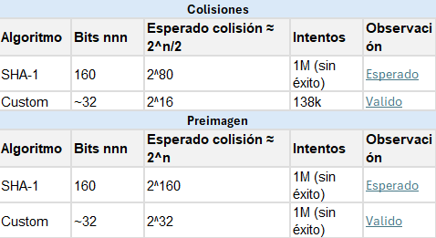

# Funciones Hash en Python

Implementación de funciones hash y evaluación de principales tipos de ataques criptográficos.

## Consigna

**Funciones Hash:**

- **Objetivo**: Implementar una función hash y evaluar principales tipos de ataques.
- **Tareas**:
  - a) Implementar una función hash sencilla o simplificada sobre las usadas en criptografía real.
  - b) Escribir código para buscar colisiones vía la paradoja del cumpleaños.
  - c) Medir el número de intentos necesarios versus la expectativa teórica.
  - d) Realizar los mismo para el ataque de preimagen.

## Objetivo

Hacer una función hash en Python, mostrar su implementación y uso comparando dos enfoques:

1. **Implementación con `hashlib`** (SHA1 real, criptográficamente seguro)
2. **Implementación custom** (hash simple, no criptográfico)

## Requisitos

- Python 3.11 o superior (probado en Windows)
- Librerías estándar: `hashlib`, `random`, `string`, `time`

## Instalación

```bash
git clone https://github.com/Francisrjs/funcion_hash_python.git
cd funcion_hash_python
```

## Desarrollo

### a) Implementación de función hash (`funcion_hash_simple.py`)

Este archivo contiene dos implementaciones:

#### 1. Implementación con `hashlib`

Utiliza la librería estándar de Python que permite realizar cifrados con algoritmos BLAKE, SHAKE, SHA1, SHA224, SHA256, SHA384, SHA512 y MD5.

```python
import hashlib

def mi_hash_simple_hashlib(texto, algoritmo='sha1'):
    """Implementa una función simple ingresando ``texto`` retorna el hash de ``algoritmo``."""
    hasher = hashlib.new(algoritmo, texto.encode('utf-8'))  # crea un objeto hasher
    return hasher.hexdigest()  # retorna el hash en formato hexadecimal

print(mi_hash_simple_hashlib("hola"))
```

**Ejemplo de salida:**

```
Entrada: "hola"
SHA1:    99800b85d3383e3a2fb45eb7d0066a4879a9dad0

Entrada: "hola " (con espacio)
SHA1:    7ed61ba66f7c458acd6800fe5c0b7307394defd2
```

La función es determinista: la misma entrada siempre produce el mismo hash. Un pequeño cambio (agregar un espacio) genera un hash completamente diferente.

#### 2. Implementación custom (sin `hashlib`)

```python
def mi_hash_simple(texto, algoritmo='sha1'):
    """Implementación simple de hash (no criptográfico)"""
    hash_value = 0
    for char in texto:
        # Usa una operación simple: (hash * 31 + ord(char)) mod 2^32
        hash_value = (hash_value * 31 + ord(char)) & 0xFFFFFFFF

    # Convierte a hexadecimal (simula el formato de SHA1 con 40 caracteres)
    if algoritmo == 'sha1':
        # Expande el hash para que parezca SHA1 (40 caracteres hex)
        return format(hash_value, '08x') * 5
    else:
        return format(hash_value, '08x')
```

Esta implementación es **deliberadamente débil** para demostrar la diferencia con algoritmos criptográficos reales.

**Uso:**

```bash
python funcion_hash_simple.py
```

### b) Búsqueda de colisiones (`funcion_hash_colisiones.py`)

#### ¿Qué es una colisión?

Una **colisión** ocurre cuando dos entradas diferentes producen el mismo hash:

```
Entrada 1: "abc123"  → Hash: XXXXX...
Entrada 2: "xyz789"  → Hash: XXXXX... (¡MISMO HASH!)
```

#### Paradoja del cumpleaños

Matemáticamente, encontrar una colisión con SHA1 es extremadamente difícil:

- SHA1 produce 160 bits = 2^160 posibles hashes
- Teóricamente necesitarías ~2^80 intentos para encontrar una colisión

#### Implementación

```python
import random
import string
import time
import funcion_hash_simple as hash_utils

def buscar_colision(algoritmo='sha1', long_cad=10, max_intentos=1000000):
    intentos = 0
    hashes_vistos = {}  # Diccionario para almacenar hashes ya vistos
    inicio = time.time()

    while intentos < max_intentos:
        # Genera una cadena aleatoria
        input1 = ''.join(random.choices(string.ascii_letters + string.digits, k=long_cad))

        # Calcula el hash
        h = hash_utils.mi_hash_simple(input1, algoritmo)
        intentos += 1

        # Verifica si ya hemos visto este hash
        if h in hashes_vistos:
            input2 = hashes_vistos[h]
            tiempo = time.time() - inicio
            return input1, input2, h, intentos, tiempo  # ¡COLISIÓN ENCONTRADA!

        # Almacena el hash para futuras comparaciones
        hashes_vistos[h] = input1

    return None, None, None, intentos, time.time() - inicio
```

#### Paso a paso del algoritmo:

1. **Inicialización**: Crea un diccionario vacío `hashes_vistos` para almacenar todos los hashes generados
2. **Generación**: En cada iteración, genera una cadena aleatoria de 10 caracteres
3. **Cálculo**: Calcula el hash de esa cadena
4. **Comparación**: Verifica si ese hash ya existe en el diccionario
   - **Si existe**: Encontró dos entradas diferentes con el mismo hash → **COLISIÓN**
   - **Si no existe**: Almacena el hash y continúa
5. **Límite**: Se detiene después de 1 millón de intentos sin encontrar colisión

**Uso:**

```bash
python funcion_hash_colisiones.py
```

### c) y d) Ataque de preimagen (`funcion_hash_preimagen.py`)

#### ¿Qué es un ataque de preimagen?

Dado un hash objetivo, buscar una cadena que produzca exactamente ese hash. Es más difícil que encontrar colisiones porque debes encontrar un hash **específico**, no cualquier colisión.

#### Implementación

```python
import random
import string
import time
import funcion_hash_simple as hash_utils

TARGET_HASH = hash_utils.mi_hash_simple("hola")

def buscar_preimagen(target_hash, algoritmo="sha1", long_cad=10, max_intentos=1_000_000):
    """Devuelve un diccionario con la cadena encontrada, intentos y tiempo que tomó."""
    intentos = 0
    inicio = time.time()

    while intentos < max_intentos:
        input_rand = "".join(
            random.choices(string.ascii_letters + string.digits, k=long_cad)
        )
        h = hash_utils.mi_hash_simple(input_rand, algoritmo)
        intentos += 1

        if h == target_hash:
            tiempo = time.time() - inicio
            return {
                "valor": input_rand,
                "intentos": intentos,
                "tiempo": tiempo,
                "hash": h,
            }

    return {"valor": None, "intentos": intentos, "tiempo": time.time() - inicio, "hash": None}
```

**Uso:**

```bash
python funcion_hash_preimagen.py
```

## Resultados Esperados

### Con la librería `hashlib` (SHA1 real)

**Colisiones:**

- Con SHA1 y 1 millón de intentos: **No se encontrará colisión** (es matemáticamente esperado)
- **Por qué:**
  - SHA1 produce 160 bits = 2^160 posibles valores
  - 1 millón = 10^6 intentos
  - La probabilidad es: 10^6 / 2^160 ≈ 0 (prácticamente imposible)

**Preimagen:**

- No se encuentra en 1 millón de intentos (esperado)

### Con la función hash custom

**Colisiones:**

```
✓ COLISIÓN ENCONTRADA!
  Input 1: bPIPSIIgc0
  Input 2: WyI2L8ieU8
  Hash común: 9271fb569271fb569271fb569271fb56
  Intentos: 138491, Tiempo: 0.4150s
```

- **Resultado**: Encuentras colisiones en 2-138,491 intentos (muy rápido)
- **Por qué funciona**: El hash custom solo tiene 2^32 valores posibles y repite el patrón 5 veces, aumentando colisiones

**Preimagen:**

```
[PREIMAGEN][600000] Iteraciones completadas
[PREIMAGEN][700000] Iteraciones completadas
[PREIMAGEN][800000] Iteraciones completadas
[PREIMAGEN][900000] Iteraciones completadas
[PREIMAGEN][1000000] Iteraciones completadas
[PREIMAGEN] ✗ No se encontró preimagen en el límite de intentos
```

- **Resultado**: 1 millón de intentos sin éxito (esperado)
- **Por qué no funciona**: Aunque hay colisiones frecuentes, encontrar un hash **específico** requiere más intentos

## Comparación de algoritmos

| Algoritmo | Estado     | Colisiones conocidas                      |
| --------- | ---------- | ----------------------------------------- |
| MD5       | Roto       | Sí (algoritmo inseguro)                   |
| SHA1      | Vulnerable | Teóricamente posible, difícil en práctica |
| SHA256    | Seguro     | No conocidas actualmente                  |
| SHA3      | Seguro     | No conocidas actualmente                  |

## Conclusiones

1.	Las funciones hash son fundamentales en criptografía  ya que se usan en todos los ámbitos en contraseñas, criptomonedas, etc. 
2.	Las colisiones son teóricamente posibles, pero prácticamente imposibles con algoritmos seguros.
3.	Utilice los algoritmos más antiguos (MD5, SHA1) tienen vulnerabilidades conocidas pero no encontré las colisiones pero si utilizamos los algoritmos modernos (SHA256, SHA3) son considerados seguros y es prácticamente difícil encontrar 
4.	Comparaciones con las pruebas :



## Archivos del proyecto

- **`funcion_hash_simple.py`**: Implementa funciones hash (hashlib y custom)
- **`funcion_hash_colisiones.py`**: Busca colisiones mediante generación aleatoria
- **`funcion_hash_preimagen.py`**: Ataque de preimagen sobre hash objetivo
- **`README.md`**: Este documento (informe completo)

## Referencias

1. [Guía para usar los algoritmos MD5 y SHA](https://recursospython.com/guias-y-manuales/hashlib-md5-sha/)
2. [Librería hashlib de Python](https://docs.python.org/3/library/hashlib.html)
3. [Comparación entre MD5 y SHA](https://www.freecodecamp.org/espanol/news/md5-vs-sha-1-vs-sha-2-cual-es-el-hash-cifrado-mas-seguro-y-como-verificarlos/)
4. Unidad 8 - Aplicaciones III - Criptografía.pdf
